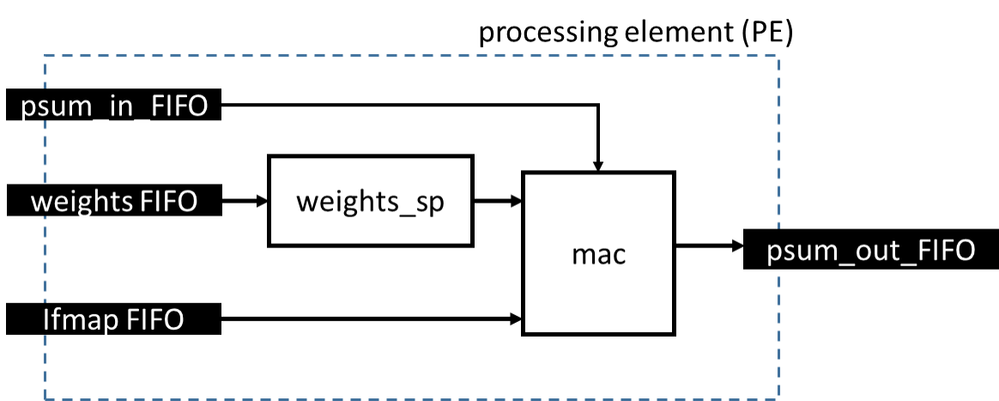
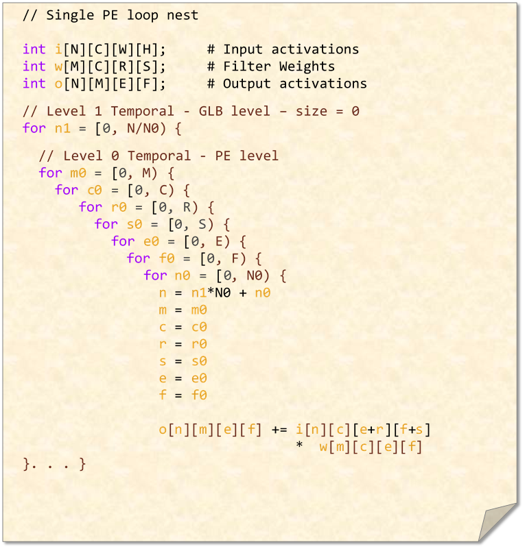

# Implementation of a standalone PE for weight stationary dataflow

   A block-level figure is shown below. In this design, FIFO are used to send different data types in and out of the PE.
   The weight scratchpad here only contains a single entry as defined by the ws dataflow. A mac unit takes in ifmap, weights, and psum data
   and outputs the computed data. ( This mac unit is able to recognize zeros in the input and realize it is actually a zero multiplication)
   
   
   
   
   The corrresponding dataflow is represented as the following loop nest
   
   
## acrch_parameters
   **NOTE: you are not supposed to change the files in this folder**
   This folder constains `arch_PE.yaml`  which is used to specify parameterized the model

## mappings
   This folder contains some example mappings. **You can add more mappings that you want to explore in this floder**
   
## model
   **NOTE: you are not supposed to change the files in this folder**
   This folder contains the components needed to construct a PE. 
   
## testbenches
   **NOTE: you are not supposed to change the files in this folder**
   This folder contains subdirectories for construcuting testbenches for differtent components in the design. In this case, we only have one for testing
   the entire PE design.

  