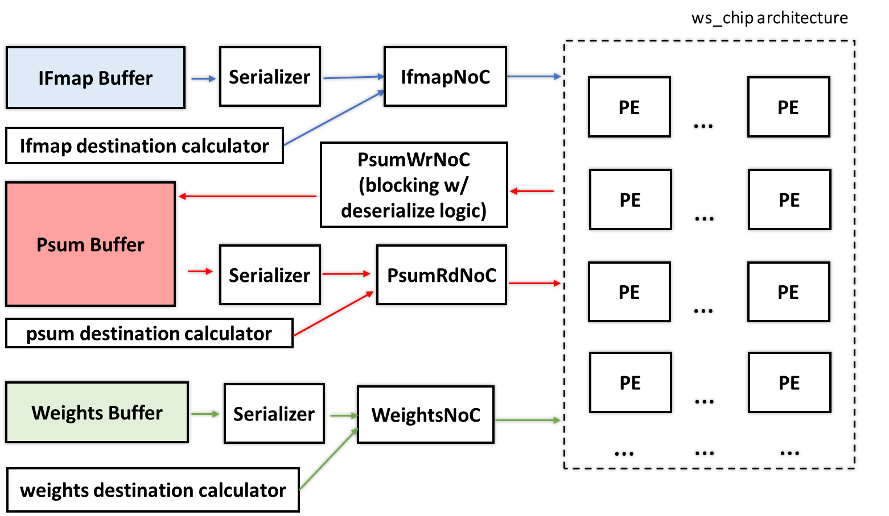
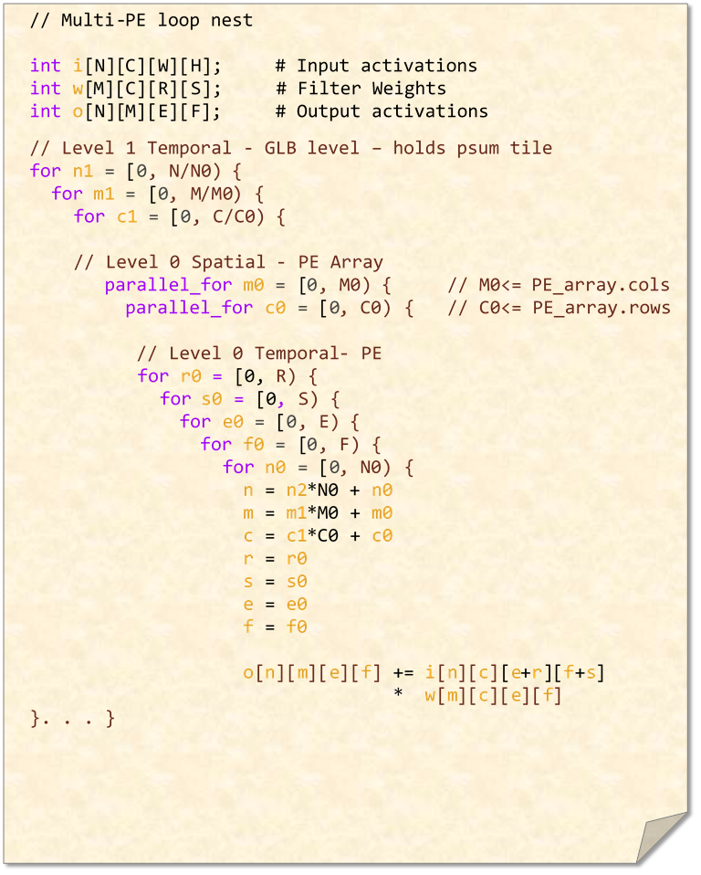

# Implementation of a PE_array chip for weight stationary dataflow

   A block-level figure is shown below. In this design, GLB buffers are used as an intermediate level of storage.
   The Read networks are responisble for sending the data from GLBs to PE array, and the Write network is responisble
   for sending calculated psums back to PsumGLB. 
   
   
   
   
   The corrresponding dataflow is represented as the following loop nest
   
   
## acrch_parameters
   **NOTE: you are not supposed to change the files in this folder**
   This folder constains `arch_PE.yaml`  which is used to specify parameterized the model

## mappings
   This folder contains some example mappings. **You can add more mappings that you want to explore in this floder**
   
## model
   **NOTE: you are not supposed to change the files in this folder**
   
## testbenches
   **NOTE: you are not supposed to change the files in this folder**
   This folder contains subdirectories for construcuting testbenches for differtent components in the design. In this case, we only have one for testing
   the entire PE design.

  